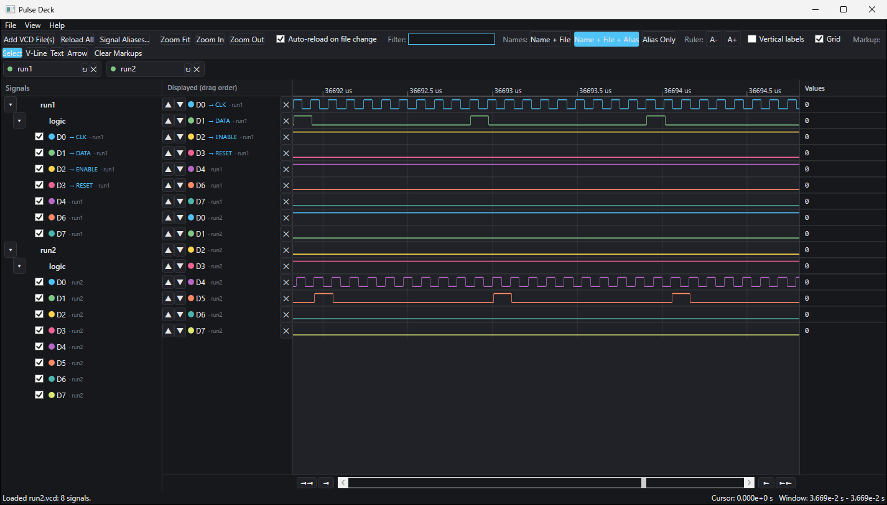
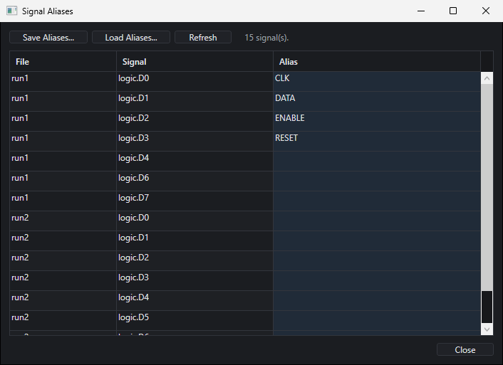

# Pulse Deck

**Version 0.1.0** (pre-release)

Pulse Deck is a multi-file VCD waveform viewer for Windows. It opens Value Change Dump (`.vcd`) files from any tool and shows signals from several files together on one shared time axis.

Loading captures from different simulation runs side by side lets you see what difference a change made to the logic states. It is also useful for working with multiple Wokwi VCD files.



## Features

- **Multiple files in one view.** Add any number of VCD files; their signals share one time axis. Each file gets a short alias you can edit, and an "END OF FILE" marker shows where each capture's data stops.
- **Auto-reload.** A file is reloaded shortly after it changes on disk, so re-running a simulation updates the view. Signals that appear are tagged `NEW`; signals that vanish are kept and shown as missing, so your layout survives.
- **Signal browser.** The file and scope hierarchy is shown as a tree. Tick signals to display them, filter by name, and set a colour per signal.
- **Your own display order.** Displayed signals are a flat list you reorder with up/down buttons, independent of the file hierarchy.
- **Aliases.** Rename any signal, choose how names are shown (name + file, name + file + alias, or alias only) globally or per signal, and save or load alias sets as `.vcdaliases` files.
- **Cursor and values.** Click the waveform to place a cursor; a values column shows each signal's value at that time.
- **Markup.** Drop vertical time markers, add text notes, and draw arrows between two points that are labelled with the time gap. Markers snap to nearby signal transitions.
- **Workspaces.** Save the loaded files, signal settings, display order, markup, and view window to a `.pulsedeck` file and reopen it later.
- **Readable at any zoom.** Signals changing faster than the screen can resolve are drawn as solid bars, so short pulses never disappear.

## Requirements

- Windows 10 or 11
- [.NET 10 SDK](https://dotnet.microsoft.com/download) to build, or the .NET 10 Desktop Runtime to run a build

## Download

Ready-to-run builds are on the [Releases page](https://github.com/fluxfocus/pulse-deck/releases). Unzip and run `PulseDeck.App.exe`.

## Build and run

Clone the repository, then build from its root:

```powershell
git clone https://github.com/fluxfocus/pulse-deck.git
cd pulse-deck
dotnet build PulseDeck.slnx -c Release
dotnet run --project src/PulseDeck.App -c Release
```

The executable is written to:

| Configuration | Path |
| --- | --- |
| Debug | `src/PulseDeck.App/bin/Debug/net10.0-windows/PulseDeck.App.exe` |
| Release | `src/PulseDeck.App/bin/Release/net10.0-windows/PulseDeck.App.exe` |

You can pass one or more `.vcd` paths on the command line to open them at startup:

```powershell
PulseDeck.App.exe C:\captures\run1.vcd C:\captures\run2.vcd
```

In VS Code, the included `.vscode` folder provides a build task and two debug configurations (press F5).

### If the build fails with `Debug|MCD is invalid`

Some PCs (commonly HP machines) set a system-wide `Platform` environment variable that MSBuild picks up. Either clear it for the session or override it:

```powershell
Remove-Item Env:Platform
# or
dotnet build PulseDeck.slnx -c Release -p:Platform="Any CPU"
```

## Using Pulse Deck

### Loading files

- **File > Add VCD File(s)...** or the toolbar button. You can select several files at once.
- Each loaded file appears as a chip under the toolbar with a status dot, an editable alias, a reload button, and a remove button.
- **Reload All** re-reads every file. **Auto-reload on file change** (on by default) does this for you.

### Navigating

| Action | How |
| --- | --- |
| Zoom in or out | Mouse wheel over the waveform (zooms around the pointer), or **Zoom In** / **Zoom Out** |
| Fit everything | **Zoom Fit** |
| Pan | Drag the waveform with the **Select** tool, use the scrollbar, or the pan buttons either side of it (1/4 or 3/4 of a screen) |
| Place the cursor | Click the waveform with the **Select** tool |

The status bar shows the cursor time and the visible time window.

### Signals

- Tick or untick a signal in the **Signals** tree to show or hide it.
- Click a signal's colour dot to change its colour.
- Use the up/down arrows in the **Displayed** column to reorder, and the cross to hide a signal.
- Type in **Filter** to narrow both lists by name.
- Right-click a signal name to rename it or choose how its name is displayed.
- **Signal Aliases...** opens a table of every signal for bulk alias editing, with **Save Aliases...** and **Load Aliases...**.



### Markup

Choose a tool from the **Markup** group, then:

- **V-Line:** click to drop a vertical time marker, with an optional label.
- **Text:** click to add a note.
- **Arrow:** drag between two points; the arrow is labelled with the time difference.
- Right-click a markup to remove it, or use **Clear Markups** to remove them all.

### Ruler and grid

**A-** / **A+** change the timestamp text size, **Vertical labels** rotates the timestamps, and **Grid** toggles grid lines.

### Workspaces

**File > Save Workspace** stores the session in a `.pulsedeck` file (JSON). It records the paths of the loaded VCD files rather than their contents, so the VCD files need to stay where they were.

## VCD support

The parser reads the standard four-state VCD format: `$timescale`, nested `$scope` hierarchies, `$var` declarations of all standard variable types, and scalar, vector (`b`), and real (`r`) value changes. It tolerates some non-conformant dumps, such as a space between a scalar value and its identifier.

## Project layout

```
PulseDeck.slnx              Solution
Directory.Build.props       Version, author, and licence metadata for all projects
src/
  PulseDeck.Core/           VCD parser, session model, workspace and alias file formats (no UI)
  PulseDeck.App/            WPF application
  PulseDeck.Core.Tests/     xUnit tests for the core library
```

## Tests

```powershell
dotnet test PulseDeck.slnx
```

The tests currently load sample VCD files from a fixed folder on the author's machine, which is not part of this repository, so they will fail elsewhere until sample files are added to the repository.

## Status

Pulse Deck is pre-1.0. File formats and behaviour may change between versions.

## Author and credits

Created by John Dowdell — [github.com/fluxfocus](https://github.com/fluxfocus)

A significant portion of the code and documentation was written by [Claude](https://claude.com), Anthropic's AI model, working through [Claude Code](https://claude.com/claude-code) under John's direction.

Source: [github.com/fluxfocus/pulse-deck](https://github.com/fluxfocus/pulse-deck)

## Licence

Pulse Deck is released under the [MIT License](LICENSE). You may use, copy, modify, and distribute it freely, including commercially, provided the copyright and licence notice is kept with any copy or substantial portion of the software. It is supplied without warranty.

Copyright © 2026 John Dowdell

### Third-party components

The application itself depends only on .NET and WPF, which are MIT licensed. The test project additionally uses:

| Component | Licence |
| --- | --- |
| xunit, xunit.runner.visualstudio | Apache-2.0 |
| Microsoft.NET.Test.Sdk | MIT |
| coverlet.collector | MIT |

These are used only for running tests and are not part of the application.
